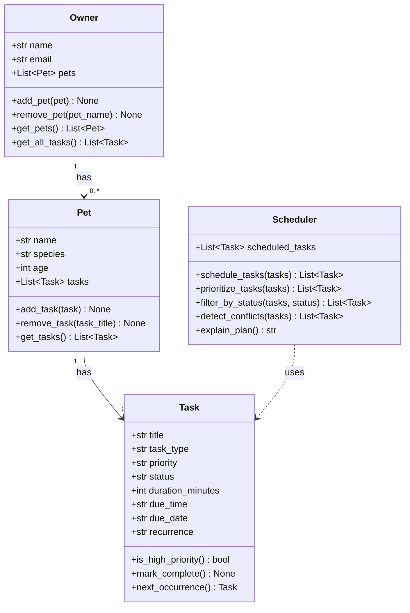

# PawPal+ (Module 2 Project)

**PawPal+** is a Streamlit app that helps a pet owner schedule and manage daily care tasks for their pets.

## Scenario

A busy pet owner needs help staying consistent with pet care. They want an assistant that can:

- Track pet care tasks (walks, feeding, meds, enrichment, grooming, etc.)
- Consider constraints (time available, priority, owner preferences)
- Produce a daily plan and explain why it chose that plan

## Features

- **Owner and pet setup** — create an owner profile and add multiple pets with name, species, and age
- **Task management** — add care tasks with title, duration, priority, due date, due time, and optional recurrence
- **Chronological scheduling** — tasks sort by `(due_date, due_time)` so the daily plan is always in true time order
- **Priority ordering** — `Scheduler.prioritize_tasks()` reorders tasks by urgency: `high → medium → low`
- **Status filtering** — view only `pending` or `complete` tasks to focus on what still needs doing
- **Pet filtering** — narrow the task list to a single pet
- **Recurring tasks** — set a task to repeat `daily` or `weekly`; when marked complete, the next occurrence is automatically added
- **Conflict detection** — tasks sharing the same `(due_date, due_time)` are flagged with a warning
- **Interactive schedule** — mark tasks done with one click; recurring tasks regenerate automatically

## Getting Started

### Setup

```bash
python -m venv .venv
source .venv/bin/activate  # Windows: .venv\Scripts\activate
pip install -r requirements.txt
```

### Run the app

```bash
streamlit run app.py
```

### Suggested workflow

1. Read the scenario carefully and identify requirements and edge cases.
2. Draft a UML diagram (classes, attributes, methods, relationships).
3. Convert UML into Python class stubs (no logic yet).
4. Implement scheduling logic in small increments.
5. Add tests to verify key behaviors.
6. Connect your logic to the Streamlit UI in `app.py`.
7. Refine UML so it matches what you actually built.

## Class Diagram



## Smarter Scheduling

Phase 4 added several improvements to how PawPal+ handles tasks:

- **Sorting by due date and time** — the schedule is ordered by `(due_date, due_time)` so tasks appear in true chronological order across multiple days.
- **Filtering by status** — owners can view only `pending` or `complete` tasks to stay focused on what still needs doing.
- **Filtering by pet** — tasks can be scoped to a single pet, useful when managing care for multiple animals.
- **Recurring tasks** — tasks can be set to repeat `daily` or `weekly`. When a recurring task is marked complete, the next occurrence is automatically created and added to that pet's schedule.
- **Conflict detection** — any two tasks sharing the same `(due_date, due_time)` are flagged with a warning so the owner can reschedule before the conflict becomes a problem.

## Testing PawPal+

To run the automated tests:

```bash
python -m pytest
```

The test suite covers six behaviors:

| Test | What it verifies |
|------|-----------------|
| `test_task_completion` | Marking a task complete sets status to `"complete"` |
| `test_add_task_to_pet` | Adding a task increases the pet's task count |
| `test_sorting_correctness` | Tasks sort correctly by `(due_date, due_time)` across days |
| `test_daily_recurrence_creates_next_occurrence` | A completed daily task generates the correct next date |
| `test_conflict_detection_flags_duplicate_times` | Two tasks at the same time are both returned as conflicts |
| `test_pet_with_no_tasks` | A new pet starts with an empty task list |

Confidence Level: 4/5
